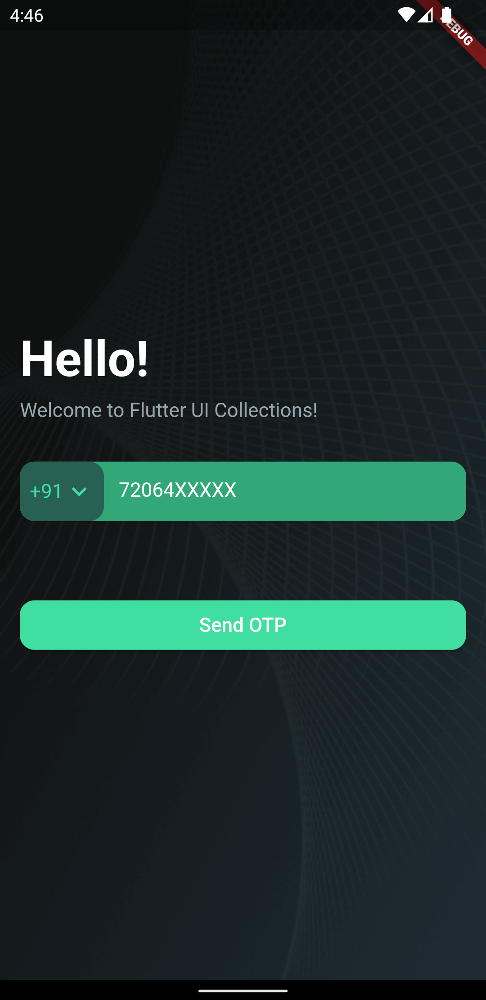
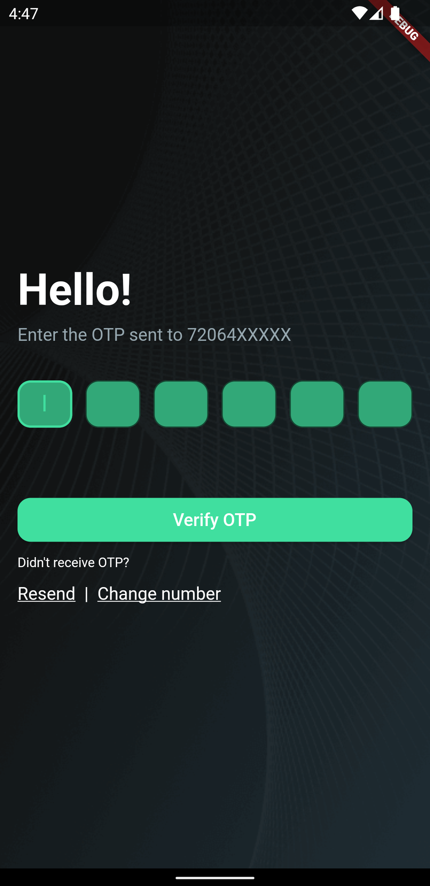
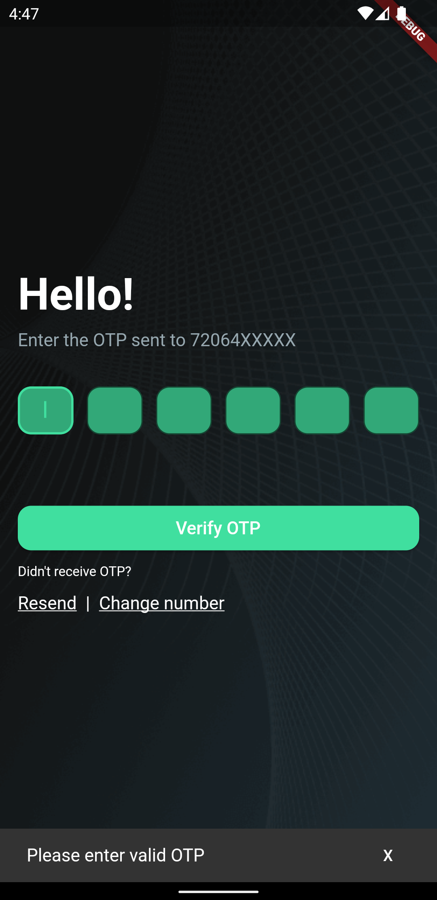
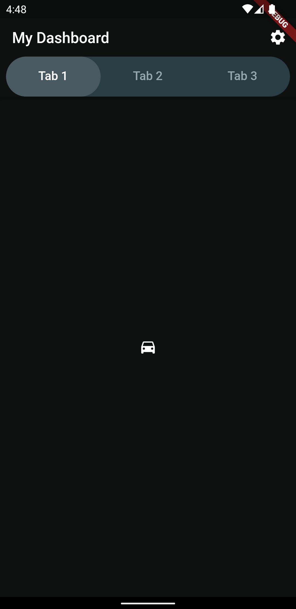

Simple Application samples such as Login, OTP Input, Tab bar, Custom Texts, Custom Colours etc with scalable folder structure.

## Getting Started

This project is a starting point for a Flutter application.

## Useful commands

1. To create a new flutter app `flutter create my_app`
2. To check missing dependencies `flutter doctor`
3. List emulators `$ANDROID_HOME/emulator/emulator -list-avds`
4. Start an emulator ` $ANDROID_HOME/emulator/emulator @1536_1024_device`
5. Check if devices are runnning `flutter devices`
6. Run app `flutter run`

## Screenshots

<table>
  <tr>
    <td></td>
    <td></td>
  </tr>
  <tr>
    <td></td>
    <td></td>
  </tr>
</table>
